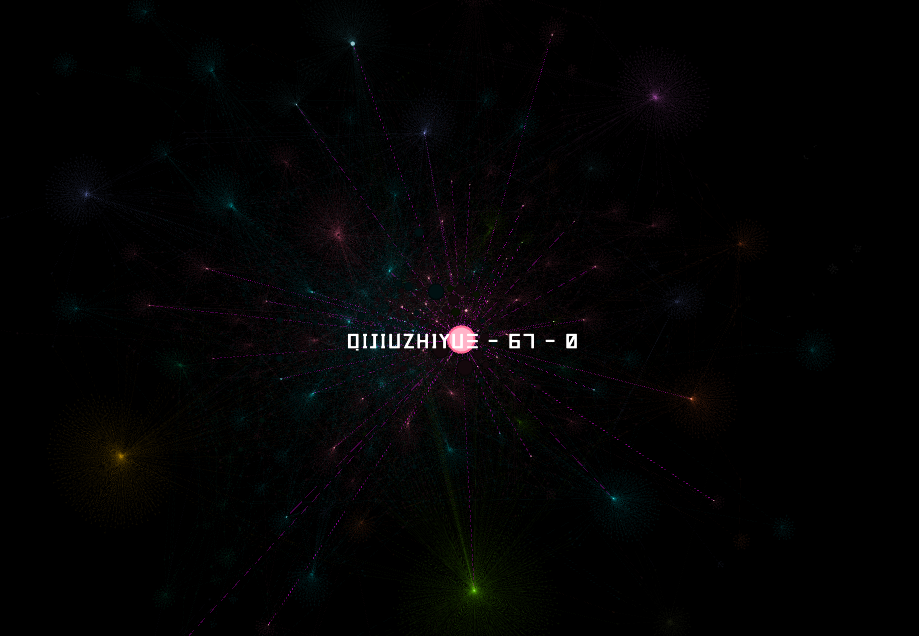

# Douban Users Social Network Visualization via Gephi

You can load the `douban_users_ntework.gephi` file into your Gephi desktop application. And you can get the figure as above.

- The size of the node suggests the amount of the followed users of a particular user. 
- The label of a node is as the norm of `ID-amount of followed users-amount of following uses`
- Different colors denote different social community.

